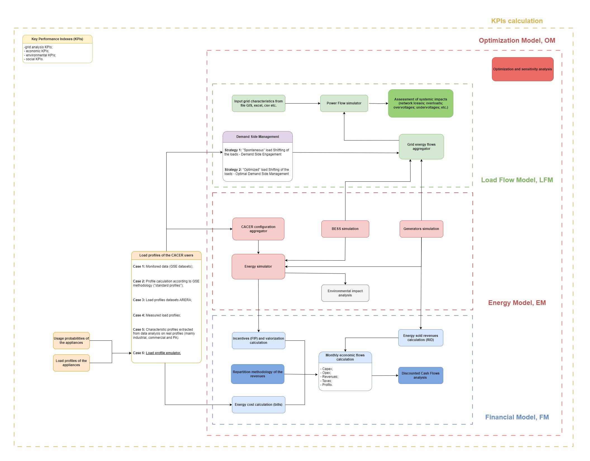

<div style="display: flex; align-items: center; justify-content: space-between; width: 100%;">
  
  
</div>

---

# CACER Simulator

This repository contains a simulation framework for assessing the **energy**, **economic**, and **financial** performance of renewable energy sharing configurations, with a focus on CACER configurations such as Renewable Energy Communities, collective self-consumption groups, and groups of remote self-consumers.

The simulator combines energy-flow modelling, user and plant registries, tariff and market inputs, incentive assumptions, and financial analysis. A typical workflow starts from the input files in `files/`, computes production and consumption profiles, evaluates shared energy and grid exchanges, optionally applies storage logic, estimates bills and revenues, and finally produces economic and financial indicators.

The main simulation logic is exposed through Jupyter notebooks and reusable Python modules in `src/`. The repository also includes a MkDocs documentation site under `documentation/`, where the detailed module descriptions and tutorials are maintained.

## What the simulator evaluates

- **Energy performance**: photovoltaic production, user demand, self-consumption, shared energy, self-sufficiency, grid import and export.
- **Economic benefits**: electricity bill savings, revenues from exported energy, CACER incentives and valorizations.
- **Financial indicators**: cash-flow analysis, Payback Period, Net Present Value (NPV), Internal Rate of Return (IRR), and stakeholder-level project views.
- **Configuration behaviour**: user, plant, configuration, stakeholder, CACER, and overall project perspectives.

## Flow chart CACER simulator

<div style="text-align: center;">
  
</div>

For detailed module documentation, see the pages in `documentation/docs/`, especially:

- `documentation/docs/tutorials/pv_simulator.md`
- `documentation/docs/tutorials/load_emulator_v1.md`
- `documentation/docs/modules/bess_simulator.md`
- `documentation/docs/modules/financial_model.md`

---

# Prerequisites

You'll need:

- **Python 3.11**: the repository currently works with this Python version.
- Required libraries listed in `requirements.txt`.
- Jupyter Notebook or JupyterLab to run the interactive notebooks.

---

# Installation

Clone the repository by downloading the folder or using Git:

```bash
git clone https://github.com/RSE-CoLabs/CACER_Simulator.git
```

## Create the virtual environment

### Method 1

1. Open a terminal in the repository folder.
2. Create a virtual environment named `.venv`:

   ```bash
   python -m venv .venv
   ```
3. Activate it:

   ```bash
   .venv\Scripts\activate
   ```
4. Install the required libraries:

   ```bash
   pip install -r requirements.txt
   ```
5. Open the tutorial notebooks and run them cell by cell. If the code does not run smoothly, check the warnings and verify that the notebook kernel is using the `.venv` environment.

### Method 2

Run the setup script:

```python
!python src/setup_venv.py
```

The script creates a virtual environment named `.venv` and installs all libraries listed in `requirements.txt`.

Then activate the virtual environment:

```bash
.venv\Scripts\activate
```

On macOS or Linux:

```bash
source .venv/bin/activate
```

To verify that a notebook is using the correct kernel, run:

```python
from src.Functions_General import check_venv_kernel

check_venv_kernel(venv_name='.venv')
```

---

# Repository Structure

- `assets/`: visual resources used by the root README and auxiliary repository material.
- `documentation/`: MkDocs documentation project. The source pages are in `documentation/docs/`.
- `documentation/docs/tutorials/`: user-facing tutorials for notebooks and simulation workflows.
- `documentation/docs/modules/`: descriptions of simulator modules and modelling assumptions.
- `documentation/docs/assets/`: images and documentation assets used by the MkDocs pages.
- `files/`: input, configuration, market, registry, and output folders used by the simulations.
- `src/`: Python source modules for energy modelling, financial modelling, load emulation, grid analysis, utilities, and virtual environment setup.
- `config.yml`: main configuration file with simulation parameters and paths.
- `requirements.txt`: Python dependencies.
- `0. Tutorial_CACER_simulator.ipynb`: tutorial version of the main CACER simulator notebook.
- `1. Tutorial_photovoltaic_simulator.ipynb`: standalone photovoltaic productivity tutorial notebook.
- `2. Tutorial_domestic_load_emulator_v1.ipynb`: tutorial notebook for the first domestic load profile emulator.
- `3. Tutorial_domestic_load_emulator_v2.ipynb`: tutorial notebook for the second domestic load profile emulator.
- `4. Tutorial_power_flow_simulator.ipynb`: notebook for load-flow and grid-oriented analyses.
- `5. Reporting.ipynb`: notebook used to generate simulation reports.
- `users CACER.xlsx`: example Excel file with user data.

---

# Citations

## Pvlib citation

This project makes use of the [pvlib](https://github.com/pvlib/pvlib-python) library, which is licensed under the BSD 3-Clause License.

Copyright (c) 2013-2024, pvlib developers.

Redistribution and use in source and binary forms, with or without modification, are permitted provided that the following conditions are met:

1. Redistributions of source code must retain the above copyright notice, this list of conditions and the following disclaimer.
2. Redistributions in binary form must reproduce the above copyright notice, this list of conditions and the following disclaimer in the documentation and/or other materials provided with the distribution.
3. Neither the name of the pvlib organization nor the names of its contributors may be used to endorse or promote products derived from this software without specific prior written permission.

## Numpy Financial citation

This project uses [NumPy Financial](https://github.com/numpy/numpy-financial), which is licensed under the BSD 3-Clause License.

Copyright (c) NumPy Developers.

Redistribution and use in source and binary forms, with or without modification, are permitted provided that the following conditions are met:

1. Redistributions of source code must retain the above copyright notice, this list of conditions and the following disclaimer.
2. Redistributions in binary form must reproduce the above copyright notice, this list of conditions and the following disclaimer in the documentation and/or other materials provided with the distribution.
3. Neither the name of the NumPy organization nor the names of its contributors may be used to endorse or promote products derived from this software without specific prior written permission.

## Icons Attribution

Some icons used in this project are designed by Flaticon and are licensed under the Flaticon Basic License.
