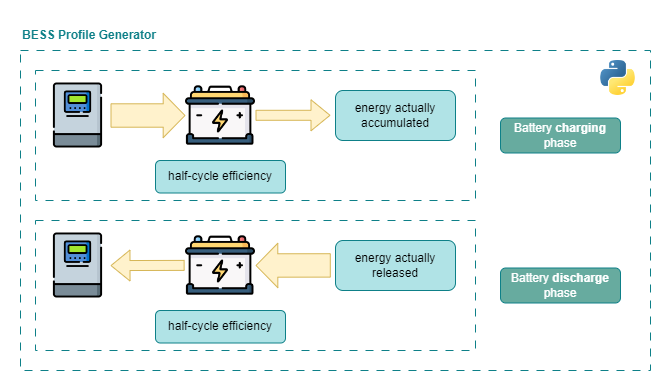

# BESS Simulator

The simulator can include a Battery Energy Storage System (BESS) for prosumers. The module performs a time-dependent calculation of the energy flows by taking production and consumption profiles as inputs, updating the battery State of Charge for each timestep, and calculating conversion losses through the round-trip efficiency. Temperature and current limitations are not included in the current implementation.

The energy hierarchy assumes that electricity production directly supplies the load first. If production exceeds the load, the excess flows into the battery. Once the battery is fully charged, the remaining production excess is injected into the grid. When production is zero or below the load, the battery is discharged to supply the demand until the demand is met or the battery is fully discharged, without injections into the grid.

With the current setup, the BESS is charged only from the prosumer generation, not from the grid. Its energy supplies only the prosumer load and is not injected into the grid.

As shown in the figure below, the module takes, for the given timestep `t`, the production excess or the energy demand at the battery terminals, updates the battery State of Charge based on the previous timestep `t-1`, and calculates the charging and discharging energy flows to and from the battery, net of the energy loss due to the half-cycle efficiency.

  

The module keeps track of the number of cycles and updates the State of Health by applying a constant derating factor to the rated capacity, which becomes relevant over the simulated years.

The inputs for the BESS are:

- **Depth of Discharge, DoD**: from `config.yml`, same for all users.
- **Rated capacity**: specific for each user, from `users CACER.xlsx`.
- **Derating factor**: from `config.yml`, same for all users.
