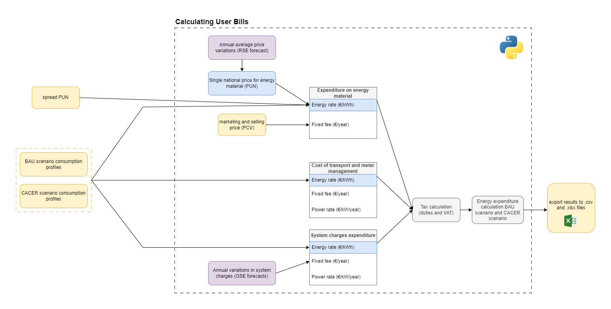
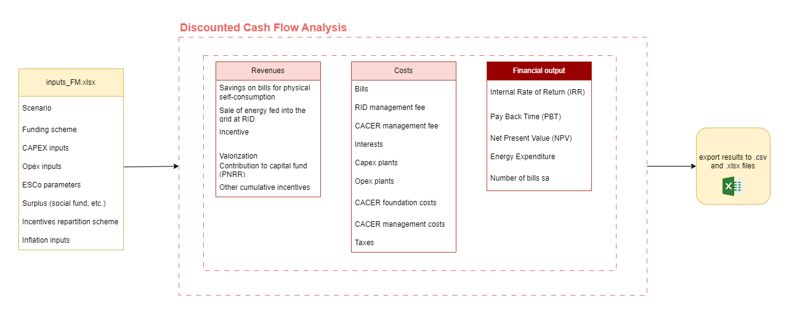

# Financial Model

## Bills Simulator

The model creates electricity bills for a given user type based on the energy withdrawal coming out of the energy model. If the user type is a consumer, it computes the business-as-usual electricity bill. If the user is a prosumer, it also includes a scenario with self-generation and reduced electricity withdrawal from the grid.

The model takes inputs from `files/mercato.yml`, where the user can manipulate market parameters and prices, define new tariffs depending on the type of user, and adjust parameters for time-dependent electricity prices.

For each user type, the model takes the following inputs from `users CACER.xlsx`:

- **Tariff scheme**: electricity time slots such as F1, F1+F2, or F1+F2+F3.
- **Supplier**: the tariff adopted, as defined by the user in `files/mercato.yml`.
- **Category**: domestic or non-domestic.
- **Range of contractual power**.
- **Voltage level**: BT, Low Voltage, or MT, Medium Voltage.

The model can simulate fixed or variable tariffs, such as PUN + SPREAD, by manipulating the `supplier` field for each user. PUN data can be manually updated in `files/PZO/PUN_input_data.csv`.

The bill is computed separately for each component, including energy, power, fixed components, duties, and VAT. The output includes timestep-level files for detailed result exploration and validation, plus monthly aggregations required by the financial modules.

  

## Financial Model and Discounted Cash Flow Analysis

  

The module collects the financial inputs from the `files/inputs_FM.xlsx` file and creates a monthly breakdown of all inflated cash flows. The analysis includes the allocation of:

- Capex, grants, debt, and amortization.
- Opex from plants and CACER.
- Revenues from electricity bill savings, incentives, RID, and ARERA valorization.
- Taxes.
- Insurance.
- EBITDA, EBIT, and Profit Before Earnings.

A discounted cash-flow analysis is then performed to calculate economic KPIs such as IRR, return on investment, and NPV.

When assessing the economic sustainability of a CACER project, it is important to evaluate KPIs for all the stakeholders involved. A project can be sustainable overall while some users do not return on their own investments, which can jeopardize the entire operation.

To assess the overall situation, the cash-flow analysis is performed on six separate levels:

- **Plant level**: includes only cash flows related to the installation, opex, and revenues of the specific plant and investment.
- **User level**: related to a single POD, whether consumer, prosumer, or producer.
- **Configuration level**: for a multi-configuration CER, evaluates the cash flows of each single configuration to measure its state of health and overall contribution. Cash flows can differ significantly based on number of users, installed capacity, and access to PNRR funds.
- **Stakeholder level**: evaluates the overall benefits for users with multiple PODs, such as Public Administrations, industries, or private entities.
- **CACER level**: tracks cash flows on the bank account of the CACER entity, including incoming cash flows such as incentives from GSE and subscription fees, and outgoing cash flows such as incentive repartition, administration costs, legal entity establishment and kickoff costs, common services, and communication.
- **Project level**: aggregates all cash flows of users, plants, configurations, and other project entities, counting each cash flow once. This level is needed to assess overall sustainability and economic impacts.

The output of each financial analysis consists of an Excel file with details on monthly and yearly cash flows, designed to be easy to manipulate for further insights.
