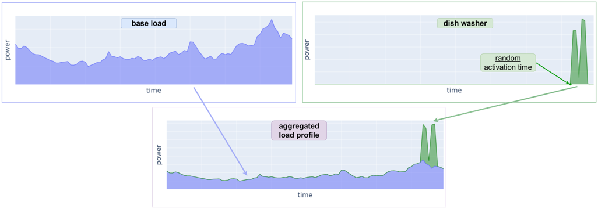
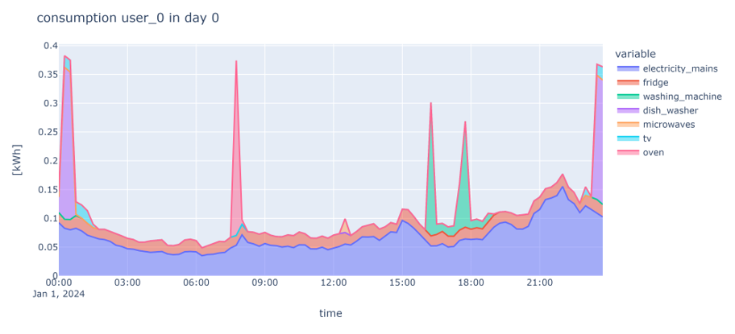

# Load Profile Domestic Users Emulator

A domestic load profile emulator has been created using the load profiles of individual household appliances and their quarterly usage probabilities.

The household appliances considered are:

- Fridge.
- Washing machine.
- Dishwasher.
- Oven.
- Microwave.
- TV.

Additionally, a base load has been added to obtain a realistic aggregate load profile. Based on the switching-on probability of each appliance, an activation instant is extracted probabilistically. The appliance consumption profile is then scheduled and added to the aggregate daily profile.

The same procedure is used for each appliance, for each day, and for each emulated user. An explanatory flow chart is reported below.

  

With this methodology, aggregate load profiles for domestic users are obtained, similar to those shown in the following explanatory figure.

  

To add greater randomness to the generation of load profiles, the following functions have been introduced and can be activated through dedicated flags:

- **Multiple daily activation of the appliance**: the appliance can be activated up to a maximum of three times per day. The number of activations is determined probabilistically.
- **Probability of activation of the appliance on the day in question**: not all appliances are activated daily. The activation is determined probabilistically.

More features will be implemented soon. Examples include:

- A larger dataset with appliance load profiles to represent different technology levels.
- Appliance profile selection based on the socio-territorial context in which the domestic users are emulated.

More information about using the emulator can be found in:

- `Load_profile_emulator_v1_with_tutorial.ipynb`.
