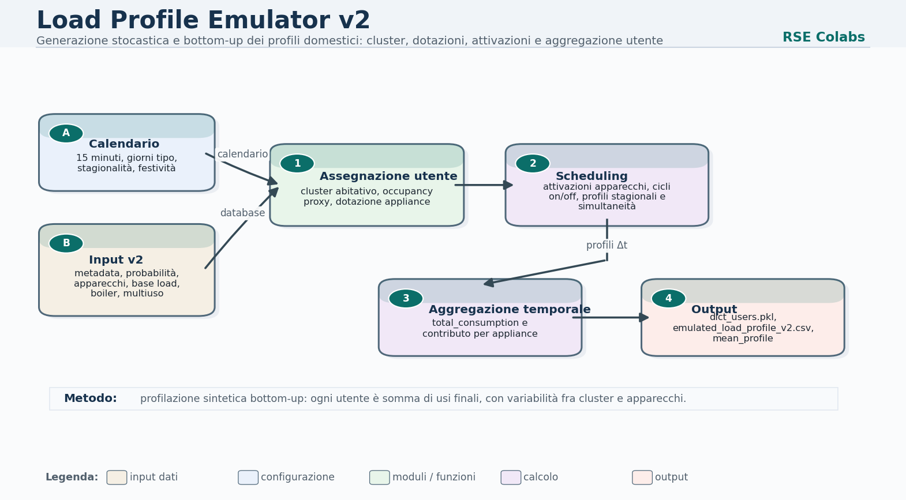
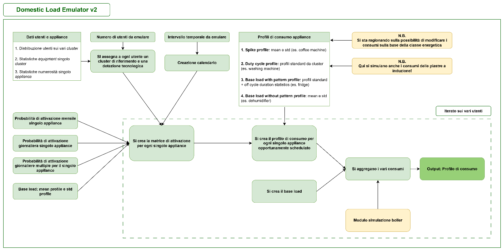
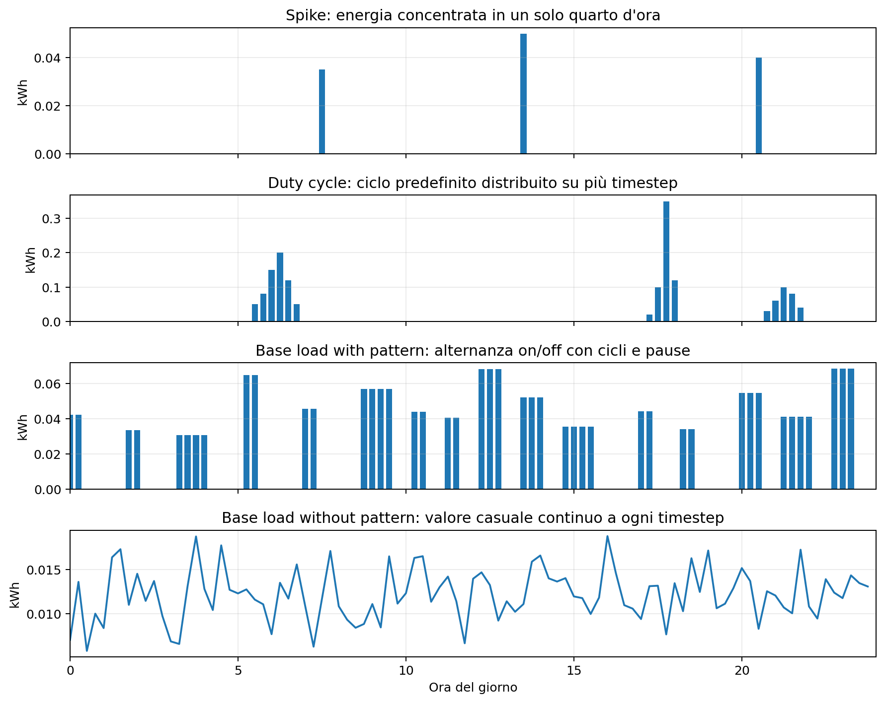
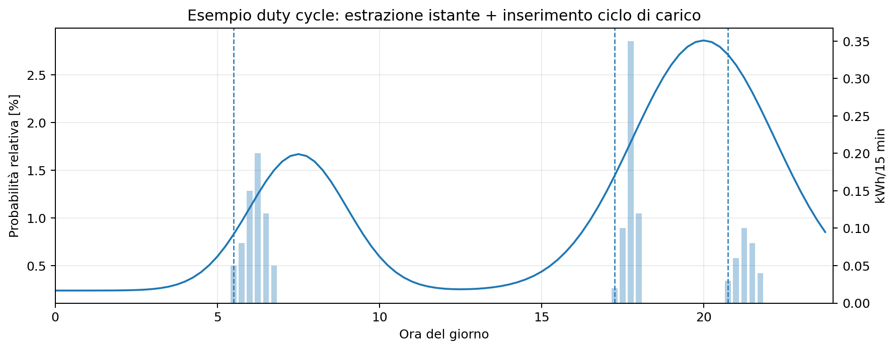
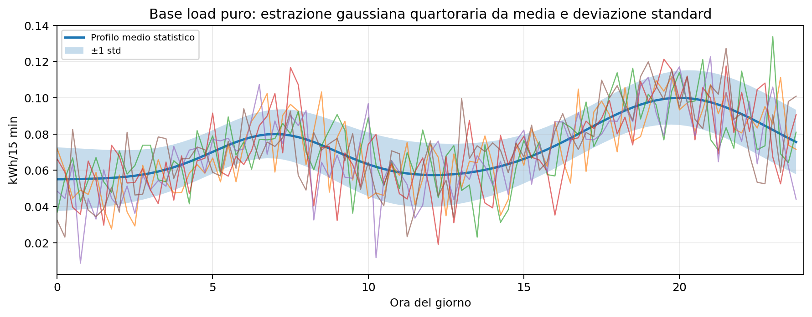
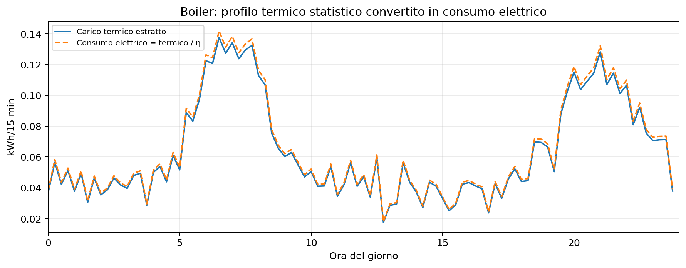

# Domestic Load Emulator Version 2.0

The `Load_profile_emulator_v2_with_tutorial.ipynb` notebook is the advanced version of the domestic load emulator developed after version 1.0. Version 2.0 extends the previous modelling logic by introducing a richer input structure:

- Metadata.
- Usage probabilities.
- Multi-use probabilities, for multiple daily activations.
- Appliance load profiles.
- Base-load profiles.
- Boiler profiles.
- National-level distributions of different user clusters.
- Technology ownership data by cluster.
- Monthly appliance activation probabilities.

The result is a more detailed emulation, but also a slower and more computationally demanding one. It is especially suitable for short periods or studies where the detail of domestic consumption is central.

  

## Emulator Logic

The emulator builds 15-minute domestic electricity consumption profiles for one or more synthetic users. The approach is probabilistic: each user is first assigned to a socio-demographic cluster; the cluster determines the probability of owning each appliance; for the owned appliances, the model then samples month, day, number of activations, and 15-minute activation instants.

At the end of the process, all device profiles, the base load, and the optional boiler are summed to obtain the total user profile.

The workflow includes the definition of the number of users and simulation period, creation of the 15-minute and daily calendars, input import, appliance-level consumption emulation, result analysis, and export. Required inputs include appliance profiles, 15-minute usage probabilities, multi-use probabilities, cluster distribution, appliance ownership probabilities, and monthly activation probabilities.

  

## Probabilistic Workflow

The emulation chain can be read as a sequence of conditional random extractions:

- **Cluster assignment**: each user is assigned to a cluster according to the `cluster_percentage_normalized` distribution.
- **Equipment assignment**: for each appliance, the model evaluates the cluster-specific ownership probability. If the appliance is assigned, the number of devices in the same category is also sampled.
- **Daily activation matrix**: for each day and appliance, the number of activations is sampled from a distribution that differs between `working_day` and `weekend`. This value is multiplied by a monthly flag, allowing some seasonal loads to be switched off.
- **15-minute scheduling**: for each daily activation, the start time is sampled using a probability curve over 96 timesteps. The curve differs between weekdays and weekends.
- **Profile insertion**: depending on the appliance type, the model inserts a standard cycle, a spike, a continuous value, or an on/off sequence.
- **Aggregation**: the consumption dataframes of the single appliances are summed with the base load and the boiler, if present.

## Input Data

The main inputs are read from Excel files configured in `config.yml`. In particular, `import_data_load_emulator_v2` loads appliance profiles, base-load statistics, 15-minute usage probabilities, multi-use probabilities, cluster metadata, and boiler profiles.

The v2.0 emulator uses the following input files and datasets:

- `metadata_load_emulator_v2.xlsx`: user-cluster metadata and appliance classifications used to organize the emulation process.
- `df_clusters_distribution`: probability of belonging to a specific user cluster.
- `df_clusters_equipment` and `df_clusters_equipment_multi`: appliance ownership and multi-ownership probabilities by cluster.
- `df_monthly_usage_probability`: monthly activation probabilities, useful for seasonal appliances such as dryers, radiators, or thermal devices.
- `usage_probability_v2.xlsx`: 15-minute appliance usage probabilities, with a distinction between working days and weekends when available.
- `multi_usage_probability_v2.xlsx`: probabilities of multiple daily uses.
- `appliances_load_profiles_v2.xlsx`: characteristic load profiles for different appliances, including 15-minute profiles and statistical profiles.
- `base_load_profiles_v2.xlsx`: base-load profiles.
- `boiler_profiles_v2.xlsx`: thermal profiles for boilers, with thermal load conversion through efficiency. In this emulation, only electric boilers are considered.

| Input | Operational meaning |
| --- | --- |
| `dict_appliances_load` | Consumption profiles or statistics by appliance. For some appliances it contains 15-minute cycles; for others it contains mean and standard deviation. |
| `dict_appliances_load_info` | Derived dictionary that classifies each appliance as `s_profile`, `dc_profile`, `blp_profile`, or `blnp_profile`. |
| `df_usage_probability_wd` / `df_usage_probability_we` | Activation probability for each 15-minute timestep, differentiated between working days and weekends. |
| `dict_multi_usage_probability` | Probability of the number of daily activations: 0, 1, 2, and so on, by appliance and day type. |
| `df_clusters_distribution` | Probabilistic distribution of user clusters. |
| `df_clusters_equipment` | Probability of owning each appliance by cluster. |
| `df_clusters_equipment_multi` | Distribution of the number of owned devices by category. |
| `df_monthly_usage_probability` | Monthly activation probability, useful for seasonal loads such as dryers or radiators. |
| `dict_base_load_stats` | Mean, standard deviation, lower, and upper statistical profiles for the base load, differentiated between working days and weekends. |
| `dict_boiler_profiles` | Statistical profiles of domestic hot water thermal load for boilers, differentiated between working days and weekends. |

## Profile Classification

The module distinguishes four appliance families. The classification is derived from the number of rows in the loaded profiles and from internal lists. If a profile has 96 rows, it can be a duty-cycle profile or a base load with pattern; freezer and fridge are forced as with-pattern profiles. If the profile does not have 96 rows, some appliances are treated as base loads without pattern, while the others are treated as spikes.

  

| Category | Logic | Typical appliances | Result |
| --- | --- | --- | --- |
| Duty cycle | Standard 15-minute profile over multiple timesteps. Each activation inserts a non-zero cycle into the dataframe. | `washing_machine`, `dishwasher`, `dryer`, `oven`, `induction_hob`, and other usage cycles. | Consumption concentrated in a time sequence with a predefined shape. |
| Spike | Very short-duration appliance. The model samples the activation instant and an energy value from a normal distribution using mean and standard deviation. | `blender`, `coffee_machine`, `iron`, `microwave`, and small impulsive loads. | A single kWh peak in the sampled 15-minute timestep. |
| Base load with pattern | Always-on or recurrent appliances with alternating on-cycle and off-cycle behaviour. The on-cycle uses a profile, while the off-cycle has random duration. | `fridge`, `freezer`. | On/off sequences reproducing a recurrent pattern. |
| Base load without pattern | Continuous appliances without a specific daily shape. At each timestep, the value is sampled from a normal distribution using mean and standard deviation. | `dehumidifier`, `fan`, `internet_router`, `radiator`, `screen`, `sound_system`, `lamp`. | Noisy continuous absorption without activation scheduling. |

## Appliance Scheduling

For schedulable appliances, the process starts from the `daily_activation_matrix`. For each day, it contains `activation_flag`, `number_of_activation`, and `day_type`. If `activation_flag` is false, the day is skipped. If it is true, the model samples a load profile and a start timestep for each activation using the 15-minute probability curve of the appliance.

For duty-cycle appliances, after the cycle has been inserted, the probability of already occupied slots is set to zero. This reduces overlaps within the same day. The start time is sampled from the 15-minute distribution, and the non-zero sequence of the profile is then inserted into `appliance_consumption_kWh`.

  

## Pure Base Load

The pure base load is not scheduled like an appliance. It is a daily statistical background profile generated directly for each calendar day. For the current `day_type`, the model reads `mean` and `std` from `dict_base_load_stats`; for each of the 96 timesteps, it samples a value from a normal distribution.

Negative values are clipped to zero and then converted from Wh to kWh by dividing by 1000. The daily vector of 96 values is written into `base_load_consumption_kWh`.

In practice, the pure base load represents residual consumption that is not explicitly attributed to the scheduled appliances: standby loads, small distributed consumption, and the statistical background consumption of the dwelling.

  

## Boiler

The boiler is treated separately from the other appliances. If `simulate_boiler=True` and the user owns a boiler, a `boiler` entry is created in the user dictionary.

The model first samples an efficiency value from a normal distribution centred around 0.97 with a standard deviation of 0.01, rounded to two decimals. It then randomly selects a boiler profile family among the available ones. For each day, it uses the statistical profile consistent with `working_day` or `weekend`.

For each day, a 15-minute thermal load profile is sampled from `normal(mean, std)`, with negative values clipped to zero. Electric consumption is calculated by dividing the thermal load by the efficiency. If `all_boiler_profiles=False`, the code restricts the choice to `boiler_1` and `boiler_4`, which are indicated in the code comments as the lower average-consumption profiles.

  

## Emulated Appliances

The effective appliance list depends on the columns of the `clusters_equipment` sheet and on the profiles available in `appliances_load_profiles_v2.xlsx`. Based on the code and tutorial, the following categories are explicitly managed:

| Group | Appliances / loads |
| --- | --- |
| Base load with pattern | `fridge`; `freezer` |
| Base load without pattern | `dehumidifier`; `fan`; `internet_router`; `radiator`; `screen`; `sound_system`; `lamp` |
| Duty cycle / usage cycles | `washing_machine`; `dishwasher`; `dryer`; `induction_hob`; other appliances with 96-row 15-minute profiles in the profile file |
| Spike / small impulsive loads | `blender`; `coffee_machine`; other appliances with mean/std statistics and one-timestep duration |
| Boiler | `boiler`, with dedicated thermal profiles for `working_day` and `weekend` |
| Lighting | `lamp`, also managed through a dedicated `scheduling_light` function that samples average power, standard deviation, and duration in 15-minute timesteps |

## Operational Sequence

The main functions called in the domestic load emulator v2.0 tutorial are:

| Function / step | Description |
| --- | --- |
| `create_calendar_dfs(start_day, end_day)` | Creates `calendar_df` and `calendar_daily`, respectively the timestep-level and daily time bases. |
| `import_data_load_emulator_v2()` | Imports all v2 emulator inputs from `files/energy/input/load_emulator/input_emulator_v2/`. |
| `remove_specific_appliance()` | Optional step that sets to zero the assignment probability of a specific appliance, for example `induction_hob`. |
| `load_emulator_v2()` | Creates users, assigns clusters and appliances, schedules profiles, simulates the boiler if required, and aggregates consumption. |
| `export_csv_emulator_v2()` | Exports the `stacked_df` dataframe with total user profiles. |
| `export_mean_profile_load_emulator_v2()` | Optional step that calculates and exports the average aggregated profile for statistical analysis. |
| `explore_dictionary()` | Optional helper function to explore the `dict_users_emulator_v2.pkl` pickle file. |
| `analyze_results()`, `plot_average_load_profile()`, `plot_average_appliance_load_profile()` | Optional analysis and visualization functions for user-level and appliance-level results. |

## Output Structure

The main result is `dict_users`, which contains, for each user, the assigned cluster, equipment, activation matrices, consumption dataframes for each appliance, base load, and aggregated total load.

In parallel, the emulator generates `stacked_df`, a dataframe containing the total profile of each user. The `export_csv_emulator_v2` function saves the total profile as CSV, using a different filename when a specific appliance is emulated.

The analysis functions can be used to explore the dictionary, extract the consumption dataframe of a single user, plot average working-day and weekend profiles, and evaluate the annual breakdown by appliance.

The main tutorial outputs are:

- `dict_users_emulator_v2.pkl`: complete dictionary containing users, appliances, profiles, detailed consumption, and assignment information.
- `emulated_load_profile_v2.csv`: dataframe with total profiles for each emulated user.
- `mean_profile_load_emulator_v2.csv`: average profile of the emulated users, optional.
- `<appliance>_emulated_load_profile_v2.csv`: specific output when a single appliance is emulated or analysed, optional.
- `<appliance>_mean_profile_load_emulator_v2.csv`: appliance-specific average profile, optional.
- Diagnostic plots: if `show_results` is `True`, plots of profiles, consumption, and appliance/user comparisons are generated.

## Code References

- Notebook: `Load_profile_emulator_v2_with_tutorial.ipynb`, especially the `Get input data` section and the call to `load_emulator_v2`.
- Module: `src/Functions_Load_Emulator_v2.py`.
- Profile classification: `create_dict_appliances_load_info` and `create_list_profile_type`.
- Cluster and equipment assignment: `assign_cluster_to_users`, `assign_equipment_to_users`.
- Daily activations: `create_daily_activation_matrix` and `monthly_activation_probability`.
- Duty-cycle scheduling: `scheduling_duty_cycle_appliances`, `extract_next_activation_time`, `extract_load_profile`, `create_scheduling`.
- Spike scheduling: `scheduling_spike_appliances`.
- Pure base load: `create_base_load_profiles`.
- Base load with or without pattern: `create_base_load_with_pattern_profiles`, `create_base_load_without_pattern_profiles`.
- Boiler: `create_boiler_profiles` and `scheduling_boiler`.
- Aggregation and export: `aggregate_load_profile`, `export_csv_emulator_v2`.
