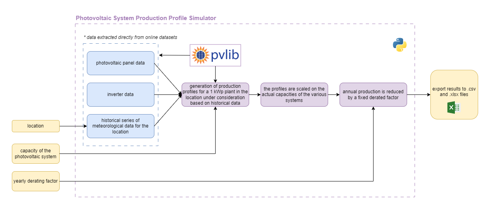

# Photovoltaic Productivity Simulator

A simulator for photovoltaic productivity has been created. The `pvlib` open source library is used to simulate the productivity of a photovoltaic generator. More information about the library can be found in the [pvlib documentation](https://pvlib-python.readthedocs.io/).

The main inputs of the simulator are:

- **Location**.
- **Capacity of the photovoltaic generator**.
- **Yearly derating factor**.

A typical meteorological year (TMY) is extracted from PVGIS datasets. The simulator currently uses the `Europe/Rome` timezone as `DatetimeIndex` for the data. The following photovoltaic module and inverter are selected to simulate the basic 1 kWp photovoltaic generator:

- **Module**: `Shell_Solar_SM100_24__2003__E__`.
- **Inverter**: `Enphase_Energy_Inc___M175_24_208_Sxx__208V_`.

The possibility of setting different types of modules and inverters will be developed later. Currently, only fixed mount systems are modelled.

The first step of the simulator creates a productivity profile for a 1 kWp generator. The productivity profile is then scaled with the capacity of the generator and derated over the years with a typical derating factor. This parameter can be changed in the `config.yml` file.

The flow chart of the photovoltaic productivity simulator is shown in the following figure.

{ width="1000" }

A notebook file is available to run a standalone simulation for a photovoltaic generator:

- `Photovoltaic_productivity_simulator_with_tutorial.ipynb`.

In this notebook the user must specify:

- **Location**.
- **Number of years of the simulation**.
- **Capacity**.
- **Tilt angle**.
- **Azimuth angle**.
- **Derating factor**.
- **Directory to save the CSV file with results**.

!!! warning
    In the CACER simulation, using `CACER_simulator.ipynb`, the inputs for the simulation of photovoltaic productivity are set in a different way through the `users CACER.xlsx` file.
